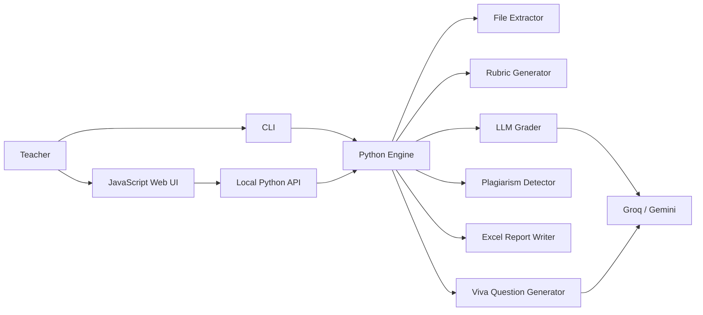
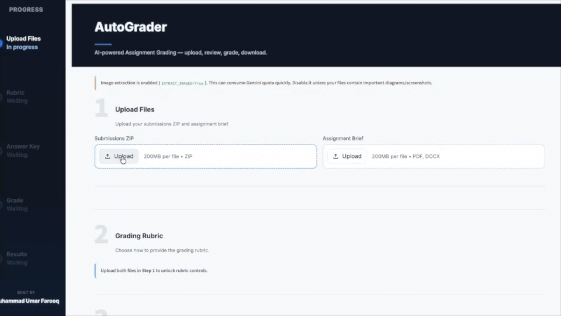
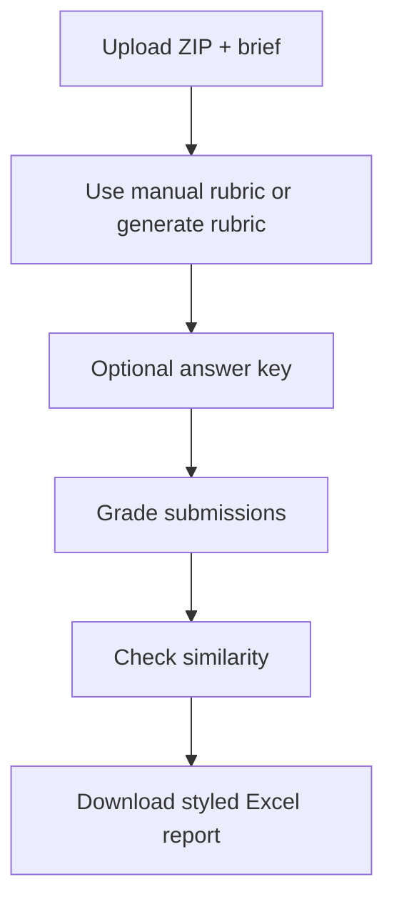
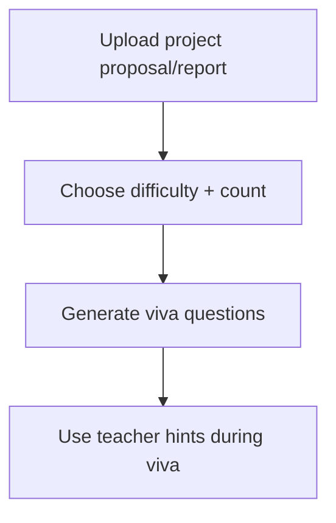

# AutoGrader

AI-powered grading agent that automates assignment evaluation using LLMs. Available as a **CLI tool** and a clean **JavaScript web UI** backed by the existing Python grading engine.

## What It Does

- Accepts a **ZIP of student submissions** + an **assignment brief**
- **Generates a structured grading rubric** with deterministic-first logic — template-matched briefs are handled without LLM; unmatched briefs use LLM (Groq / Gemini fallback)
- Supports **automatic rubric parsing** from pasted JSON/table/line formats, with LLM fallback only when deterministic parsing fails
- Lets you provide or generate an **answer key/solution** (manual, file upload, or LLM-generated) for accurate grading
- Supports an optional **student roster Excel** (Name + ID). When provided, student identity is taken from the roster so grading does not depend on parsing IDs/names from submission content.
- **Grades each submission** against the rubric — LLM evaluates each criterion and provides a score with a brief reason; **all math is done by Python** (totals, deduction amounts, deduction text formatting, score capping)
- Resolves **student name and ID deterministically**:
  - With roster: identity comes from roster entries.
  - Without roster: fallback order is **filename → folder name → document content**.
- **Detects plagiarism** using dual similarity analysis (TF-IDF cosine + character n-gram), with teacher-controlled flag threshold and optional mark deduction policy
- Outputs a styled **Excel report** with per-criterion breakdown, class statistics, and class insights (top 3 common mistakes)
- Generates **project viva questions** from uploaded proposals/reports, including teacher-facing answer hints

## Architecture



## Demo

Below is an older demo of the original Streamlit UI:




## Project Structure

```
AutoGrader/
├── main.py                          # CLI entry point — orchestrates the full pipeline
├── app.py                           # Legacy Streamlit web UI
├── config.py                        # Centralized settings (.env loader)
├── requirements.txt                 # Python dependencies
├── .env                             # Local Secrets (Gitignored)
├── .env.example                     # Environment variable template
├── README.md                        # This file
├── LICENSE                          # MIT License
├── demo.gif                         # UI Demonstration
├── .streamlit/
│   └── config.toml                  # Streamlit theme configuration
├── docs/
│   └── workflow.md                  # Detailed pipeline documentation
├── web_ui/                          # JavaScript web UI + local Python API server
│   ├── server.py                    # Serves static UI and background grading/viva jobs
│   └── static/
│       ├── index.html
│       ├── styles.css
│       └── app.js
├── scripts/
│   └── dev_generate_sample_excel.py # Dev utility: generate sample Excel preview report
├── tests/
│   └── test_autograder.py           # Test suite (pytest)
├── utils/                           # Shared utilities
│   ├── cache.py                     # Crash-recovery grading cache
│   ├── llm_client.py                # LLM dual-routing API wrapper with per-provider circuit breaker
│   └── retry.py                     # Exponential backoff for API calls
├── rubrics/                         # Rubric templates for common assignment types
│   ├── programming_assignment.json  # Correctness, Code Quality, etc.
│   └── essay_assignment.json        # Argument, Evidence, etc.
└── skills/                          # Core agent skills
    ├── rubric_generator/
    │   ├── SKILL.md                 # Agent instructions (Self-Correcting Rubric)
    │   └── rubric_agent.py          # LLM rubric generation + approval loop
    ├── grader/
    │   ├── SKILL.md                 # Agent instructions (Concurrency & Accuracy)
    │   └── grader_agent.py          # Concurrent LLM grading engine
    ├── plagiarism_detector/
    │   ├── SKILL.md                 # Agent instructions (Similarity Logic)
    │   └── plagiarism_agent.py      # Dual similarity analysis
    ├── file_extractor/
    │   ├── SKILL.md                 # Agent instructions (Parsing Logic)
    │   └── extractor.py             # ZIP extraction, nested archives, and file readers
    ├── viva_generator/
    │   ├── SKILL.md                 # Agent instructions (Viva Questions)
    │   └── viva_agent.py            # Project proposal/report viva question generation
    └── report_writer/
        ├── SKILL.md                 # Agent instructions (Export Logic)
        └── excel_writer.py          # Styled Excel report generator
```

## Supported File Formats

| Format | Library | Image Support |
|--------|---------|---------------|
| PDF | PyMuPDF | Yes — embedded images extracted and described via Gemini Vision |
| DOCX | python-docx | Yes — media images extracted and described via Gemini Vision |
| .py | stdlib | — |
| .cpp | stdlib | — |
| .ipynb | stdlib JSON | — |
| .md / .txt | stdlib | — |

### Nested Student Archives

The main class upload should still be a ZIP file. Inside that ZIP, individual student submissions may contain nested `.zip`, `.rar`, or `.7z` files. Nested ZIP files work with Python's standard library. Nested RAR/7z files are extracted when a local archive tool is available, such as `bsdtar`/libarchive or `7z`. If no compatible tool is installed, the report will show a clear extraction error for that student's submission instead of silently skipping it.

### Image Extraction

Embedded images in PDF and DOCX files can be automatically extracted and sent to Gemini's vision model for description by enabling `EXTRACT_IMAGES=True` in your `.env`. Each description is appended to the document text as `[Image: <description>]`, giving the grading LLM full visibility into diagrams, charts, code output screenshots, and handwritten content. If the vision API fails for any image, it is skipped silently — extraction never crashes.

## Limitations

When evaluating very large assignments or bulk processing dozens of submissions at once, you may experience connection limits or timeouts with the default APIs:
- **Free API Tiers (e.g., Groq)**: Free tiers often fail due to strict token rate limits or context window restrictions when feeding massive code blocks or theory text into the LLM. Oversized submissions are processed in overlapping chunks and then aggregated into one final grade, so content is not truncated. For very large cohorts or extremely long files, upgrading to a **Paid API** (like OpenAI GPT-4o or Anthropic Claude 3.5) with higher rate limits is still strongly advised.
- **Chunked grading controls**: Tune `CHUNKED_GRADING_CHAR_LIMIT`, `CHUNKED_GRADING_CHUNK_CHARS`, and `CHUNKED_GRADING_OVERLAP_CHARS` in `.env` if your provider has a smaller or larger context window.
- **Local Models (e.g., Ollama)**: Attempting to bypass API limits by using local models via Ollama will solve rate-limiting but introduces significant overhead. Local inference on huge text inputs requires an extremely long processing time and can frequently lead to API connection timeouts or system resource exhaustion, unless running on enterprise-grade hardware.

> **Agentic IDE Workaround**: If you run into these API limitations, you can use any advanced AI IDE (Cursor, GitHub Copilot, Antigravity, etc.) to evaluate the assignments autonomously. Just point the IDE's agent to `docs/workflow.md` and provide it the file paths of your submissions, assignment brief, rubric, and answer key. The agent can then use the workflow rules to grade the files locally and generate the finalized Excel report for you manually.

## Quick Start

```bash
# 1. Install dependencies
pip install -r requirements.txt

# 2. Set up your API keys
cp .env.example .env
# Edit .env and add your GROQ_API_KEY and GEMINI_API_KEY

# 3a. Run via CLI
python main.py submissions.zip assignment_brief.pdf
# Optional: pass a roster Excel with Name/ID columns
python main.py submissions.zip assignment_brief.pdf student_roster.xlsx

# 3b. Run via JavaScript Web UI
python web_ui/server.py
```

## Web UI

The JavaScript interface (`web_ui/`) is the recommended browser UI. It keeps the screen light and task-focused while calling the same Python skill modules as the CLI.

### Assignment Grading



1. Upload a submissions ZIP and assignment brief.
2. Optionally upload a student roster and answer key.
3. Paste a manual rubric, or leave it blank for automatic rubric generation.
4. Set the similarity policy:
   - **Flag threshold (%)** is the minimum combined similarity score needed before two submissions are flagged. Higher values create fewer, stricter flags; lower values catch more possible copying but may need more review.
   - **Marks to deduct if flagged** is applied once per flagged student. Keep it at `0` to report similarity without changing marks.
5. Start grading, watch progress, then download the styled Excel report.

### Viva Questions



1. Upload a project proposal or report.
2. Choose difficulty and question count.
3. Generate project-specific viva questions with concise teacher hints.

```bash
# Start the JavaScript web UI
python web_ui/server.py

# Open in your browser
http://127.0.0.1:8765
```

The Streamlit interface (`app.py`) is still available as a legacy UI:

.venv/bin/streamlit run app.py
```

## Configuration

All settings are in `.env` (see `.env.example`):

| Variable | Default | Description |
|----------|---------|-------------|
| `GROQ_API_KEY` | — | Your Groq API key (**Primary — recommended**) |
| `GEMINI_API_KEY` | — | Your Gemini API key (Secondary fallback) |
| `MODEL` | `llama-3.3-70b-versatile` | Primary Groq model |
| `GEMINI_MODEL` | `gemini-2.0-flash` | Fallback Gemini model (unavailable in some regions) |
| `EXTRACT_IMAGES` | `False` | Turn on to extract and describe images |
| `MAX_CONCURRENT_GRADES` | `1` | Parallel grading workers |
| `CHUNKED_GRADING_CHAR_LIMIT` | `45000` | Prompt size where chunked grading begins |
| `CHUNKED_EVIDENCE_AGGREGATION_CHAR_LIMIT` | `36000` | Evidence size where hierarchical aggregation begins |
| `CHUNKED_EVIDENCE_GROUP_SIZE` | `8` | Max evidence blocks per intermediate aggregation batch |

## Tech Stack

- **LLM Engine**: Provider-routed fallback (**Groq primary, Gemini fallback**) with circuit-breaker recovery
- **Vision**: Gemini API (for diagram understanding in PDFs/DOCX)
- **Plagiarism**: Scikit-Learn (TF-IDF) + Character N-Gram Jaccard
- **Reports**: Styled Excel output with `openpyxl`
- **Frontend**: Vanilla JavaScript, HTML, and CSS served by a local Python API
- **Legacy Frontend**: Streamlit
- **CLI**: Rich-enhanced python scripting

## Author

Muhammad Umar Farooq — [GitHub](https://github.com/omerfarooq223)
