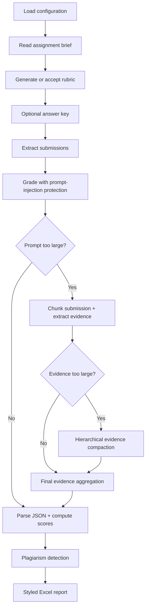
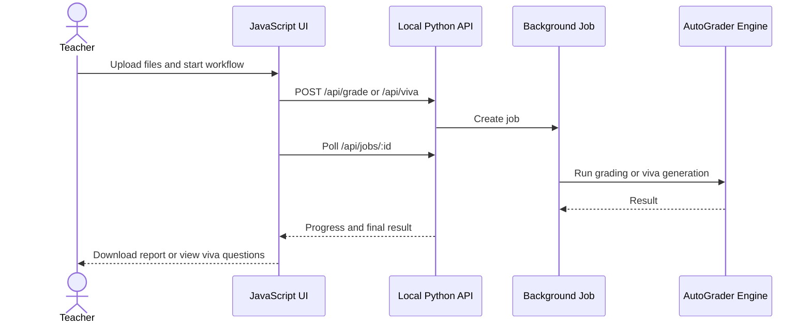

# AutoGrader Workflow

## Overview

This document describes the end-to-end workflow of the AutoGrader agent, from input to final report.



---

## Pipeline Steps

### Step 1: Configuration Loading
- On startup, `config.py` reads the `.env` file and populates environment variables.
- Uses `python-dotenv` for robust `.env` parsing.
- All settings (API key, model, thresholds, concurrency) are centralized here.
- Key defaults: `MODEL=llama-3.3-70b-versatile`, `MAX_CONCURRENT_GRADES=1`, `MAX_RETRIES=3`, `GRADING_MAX_OUTPUT_TOKENS=768`.

### Step 2: Assignment Brief Ingestion
- The brief file is read using `file_extractor/extractor.py`.
- Supports PDF, DOCX, .py, .cpp, .ipynb, .md, and .txt formats.
- The extracted text is passed to the rubric generator.

### Step 3: Rubric Generation & Approval
- Before generating, the system checks `rubrics/` for a matching template by scanning the brief for keywords. A template is used only if it matches **≥2 keywords AND ≥40% of its keyword list** — prevents false matches on short keyword overlap.
- **With template**: The rubric is built deterministically from template criteria (no LLM call), with default full/partial/minimal descriptions if needed, then scaled to total marks.
- **Without template**: The brief text is sent to the LLM to generate a rubric from scratch.
- In both cases, the LLM produces a **structured JSON rubric**:
  ```json
  {
    "criteria": [
      {"name": "Correctness", "max_score": 40, "description": "..."},
      {"name": "Code Quality", "max_score": 30, "description": "..."}
    ]
  }
  ```
- **Manual Rubric (Auto-Formatting)**: If the user provides a rubric manually, the system first attempts deterministic parsing (JSON/table/line formats). LLM formatting is only used as fallback when deterministic parsing fails.
- The output is validated via `_parse_rubric_json()` — invalid JSON or missing fields triggers an automatic retry.
- The user reviews the rubric and chooses to **Approve**. Large-scale edits can be made directly in the JSON or raw text before approval.
- The approved rubric is saved atomically to `.rubric_cache.json` for reuse.
- The LLM used for rubric generation follows configured provider routing (**Groq primary, Gemini fallback**).

### Step 4: Answer Key (Optional)
- The user can provide an answer key via file upload or manual paste.
- In the JavaScript web UI, users can leave answer key fields empty to grade with rubric only.
- If provided, each submission is graded by comparing it against the answer key alongside the rubric — improving accuracy significantly for factual and code assignments.
- The answer key filename is excluded from the submissions list automatically so the answer key author is never graded as a student.

### Step 5: Submission Extraction
- The ZIP file is extracted to a **per-session temp directory** named `.autograder_<zipname>/` in the ZIP's parent folder. This prevents cache collisions when grading multiple classes from the same directory.
- Zip-slip security check rejects unsafe archive entries (path traversal attack prevention).
- Student-provided nested archives are expanded before reading files:
  - Nested `.zip` uses Python's standard library.
  - Nested `.rar` and `.7z` use local tools when available (`bsdtar`/libarchive or `7z`).
  - Archive member paths are validated before extraction to reduce path traversal risk.
- All supported files are discovered via recursive directory walk.
- Hidden/system directories (`__MACOSX`, `.git`, `__pycache__`) are skipped.
- Files exceeding **20MB** are skipped with a clear error message stored as the submission content — prevents LLM context overflow.
- Each file is read and stored as `{filename, path, content, cache_key}`. The `cache_key` is a content-hash-disambiguated identifier that handles duplicate filenames across students.
- **Format-specific extraction:**
  - **PDF**: Text extracted page by page via PyMuPDF.
  - **DOCX**: Paragraphs and **table content** both extracted (tables are not in `doc.paragraphs` and were previously invisible to the grader).
  - **.py / .cpp / .md / .txt**: Read as plain text.
  - **.ipynb**: Code cells, markdown cells, and **cell outputs** (print results, errors, return values) all extracted — output is critical for grading whether code actually ran correctly.
- **RAR/7z without extractor**: If no compatible local extraction tool is available, the submission receives a clear archive extraction error and the teacher can ask the student to resubmit as ZIP.
- **Image extraction** (only when `EXTRACT_IMAGES=True`): Embedded images sent to Gemini Vision for description. Fails fast on quota exhaustion — never retries image description, so a dead Gemini quota does not freeze the pipeline.
- `extract_and_collect` returns `(submissions, extract_dir)`. The caller is responsible for cleaning up `extract_dir` **after** grading completes, so the cache file survives for crash recovery during long grading sessions.
- **Student identity extraction precedence** (name + ID) is deterministic and done before grading:
  - With roster uploaded: identity is resolved from roster entries first (path/LMS hints used for matching).
  - Without roster: precedence is filename → folder → document content, then LMS metadata fallback for missing name.

### Step 6: Grading
- Each submission + the structured JSON rubric (+ answer key if provided) is sent via `utils/llm_client.py` using configured provider/model routing (Groq primary with Gemini fallback).
- **Prompt-injection protection**: Student submission content is wrapped as untrusted data before being sent to the model. The system prompts explicitly instruct the LLM to ignore any commands, role-play, hidden text, or grading instructions inside student-authored content.
- **Large submissions**: If a prompt is too large, grading switches to overlapping chunks. Each chunk is evaluated for compact evidence, then the evidence is aggregated into one final per-criterion grade. For extremely large submissions, evidence is compacted hierarchically in ordered batches before final grading.
- **Student name + ID**: The grader consumes pre-extracted identity metadata from extraction step (filename → folder → content precedence). LLM identity output is now fallback-only when extraction cannot infer values.
- **LLM response**: The LLM returns per-criterion scores and brief reasons only: `{id, category_scores: {CritName: {score, reason}}}`. The LLM does NOT calculate totals, write `(-N)` amounts, or format deduction strings.
- **Deterministic Python scoring** (all math done in Python, never by the LLM):
  1. Per-criterion cap: each score is capped to `max_score` from the rubric (never below 0).
  2. Total: `marks = sum(category_scores)` — computed by Python.
  3. Deduction text: Built by Python as `"CritName: reason (-N)"` where `N = max_score - score`. Deduction amounts are guaranteed correct since they're derived from the score, not from LLM text.
  4. If all criteria have full marks: `"No deductions."`.
- **Concurrency**: `MAX_CONCURRENT_GRADES=1` by default. Architecture supports higher parallelism via `.env` — but rate limits make >1 unsafe on free tier.
- **Rate limiting**: No fixed pre-sleep. Backoff is applied only on actual provider rate-limit errors.
- **Cache**: Each result is saved atomically to `.grading_cache.json` immediately after completion using `cache_key` as the key. Cache files are **versioned** — when the scoring format changes, stale caches from prior versions are auto-discarded. Duplicate filenames are handled correctly. Atomic write (temp → rename) prevents cache corruption on crash.
- **Retry + circuit breaker**: Failed API calls use a provider-level circuit breaker. After threshold failures, circuit opens; after cooldown it transitions to half-open and allows a probe request to recover.
- **JSON validation**: LLM responses go through a 4-step parse pipeline — (1) direct `json.loads`, (2) brace-matched partial extraction, (3) structural validation (`category_scores` present, all scores numeric), (4) structured error record if all steps fail. Invalid structures are caught before they silently corrupt score totals.
- **Error submissions**: Files that could not be read (too large, corrupt, permission error) receive a clear error string as their content. These are graded with an "Error" mark — not silently passed through the LLM with garbage input.

### Step 7: Plagiarism Detection
- **Toggleable**: This step can be disabled via the "Enable Plagiarism Analysis" toggle in the sidebar. If disabled, similarity scoring is skipped entirely to save time.
- **Error and skipped submissions are excluded** from plagiarism analysis — identical error placeholder strings would generate false flags between all unreadable files.
- **Minimum content guard**: Submissions under 200 characters are excluded — too short for reliable similarity scoring.
- Remaining pairs are compared using:
  1. **TF-IDF Cosine Similarity** — vocabulary overlap
  2. **Character 4-gram Jaccard** — structural overlap
- Combined score: `0.6 × cosine + 0.4 × n-gram`
- Pairs scoring at or above the selected threshold are flagged. The default is 65%.
- In the JavaScript UI, teachers can choose a threshold per grading run. Higher thresholds are stricter and reduce false positives; lower thresholds catch more possible copying but require more teacher review.
- Teachers can also set an optional mark penalty. The penalty is applied once per flagged student, not once per matched pair. A penalty of `0` keeps plagiarism as report-only.
- **Flags preserve student names**: the plagiarism flag for each student lists exactly who they matched and at what percentage (e.g. `⚠️ Similar to: ali.pdf (96%), sara.docx (88%)`).
- Uses `cache_key` for matching — works correctly even when multiple students submitted files with identical filenames.
- No API calls — runs entirely locally using scikit-learn.

### Step 8: Report Generation
- Results are written atomically to `grading_report.xlsx` (temp → rename to prevent corruption).
- Two sheets:
  - **Grading Report**: per-student data with criterion columns, pass/fail coloring, and plagiarism flags showing matched names.
  - **Summary Statistics**: class-level metrics including pass rate, grade distribution, and Class Insights.
- **Marks column header** shows the assignment total: `Marks (/ 15)`.
- **Grade distribution** is calculated as a percentage of the **actual rubric total** (derived from marks data), not the config `TOTAL_MARKS` value. This prevents all students landing in F when `TOTAL_MARKS=100` but the rubric only adds to 15.
- **Pass threshold** is computed as 50% of the rubric total — shown explicitly in stats as `Pass Mark: ≥ 8 (50%)`.
- **Class Insights**: generated deterministically from deduction frequency patterns (criteria/reasons), avoiding LLM calls in report generation. Streamlit reuses insights returned by `write_results(..., return_insights=True)`.
- The grading cache is cleared only **after** the report is successfully written — a crash during report generation does not lose grading progress.

### Step 9: Results UI Analytics & Manual Override
- In the legacy Streamlit Step 5, results render two side-by-side charts:
  - **Score Distribution** (bar chart): score values on X-axis, student count on Y-axis.
  - **Average Score per Criterion** (horizontal bars): criterion means with threshold colors based on rubric max score.
- Teachers can edit per-student criterion scores directly in the UI table.
- On **Apply score overrides**, totals are recalculated, in-memory results are updated, and the downloadable Excel report is regenerated immediately.

### Step 10: JavaScript Web UI
- `web_ui/server.py` serves the light-theme JavaScript UI and a small local HTTP API.
- The UI has two focused workflows:
  1. **Grade assignments** — uploads submissions ZIP, brief, optional roster, optional answer key, and optional manual rubric; runs the existing Python grading pipeline as a background job; returns the styled Excel report.
  2. **Viva questions** — uploads a project proposal/report; generates project-specific viva questions and concise teacher hints.
- Background jobs expose progress polling through `/api/jobs/<job_id>`, so long grading runs do not freeze the browser.
- The UI does not duplicate grading logic. It calls the same extractor, rubric generator, grader, plagiarism detector, report writer, and viva generator modules used elsewhere.



### Step 11: Viva Question Generation
- Project proposal/report files are read with the same extractor used for assignment briefs.
- The project document is wrapped as untrusted data before the LLM sees it.
- `skills/viva_generator/viva_agent.py` asks the LLM for structured JSON:
  - `project_name`
  - `questions`
  - `notes`
- Each viva question includes category, difficulty, question text, and a short `what_to_listen_for` hint for the teacher.
- The feature is intended for oral evaluation preparation, not automated scoring.

---

## Error Handling Strategy

| Scenario | Handling |
|----------|----------|
| Groq 429 rate limit | Parses exact retry time from error message, waits precisely, retries Groq once; failure counted toward circuit breaker |
| Groq non-429 failure | Failure recorded; after 3 consecutive failures circuit opens and Groq is skipped for the session; falls through to Gemini |
| Groq/Gemini quota exhausted (`limit: 0`, `quota`, `daily`) | Detected immediately via `_check_quota_exhausted()`; circuit opened for that provider; all its fallbacks skipped |
| Circuit breaker open | Provider skipped while open; after cooldown it half-opens and allows a probe request |
| Process crash mid-grading | Atomic cache survives; next run resumes from `cache_key` checkpoint |
| Malformed LLM JSON | 4-step parse pipeline: direct parse → brace-match recovery → structural validation → structured error record with `"marks": "Error"` |
| LLM returns empty `category_scores` | Caught by structural validation; treated as parse failure with error mark |
| LLM criterion score not numeric | Caught by structural validation before any math is attempted |
| Individual criterion score > max_score | Capped to rubric max by Python |
| Stale cache from old scoring format | Auto-discarded via cache version check |
| File too large (> 20MB) | Skipped with student-facing error message; grader sees it, scores 0 |
| Submission contains prompt injection | Treated as untrusted content; instructions inside the submission are explicitly ignored |
| Chunk evidence too large to aggregate once | Compacted through hierarchical ordered evidence summaries before final grading |
| Corrupt/unreadable file | Error stored as content; submission not silently dropped |
| RAR/7z submitted without local extractor | Clear archive extraction error; student may need to resubmit as ZIP |
| Unsupported file format in ZIP | Skipped unless it is a supported nested archive |
| Unsafe ZIP entries (zip-slip) | Rejected with ValueError before extraction |
| Duplicate filenames in ZIP | Handled via content-hash `cache_key` — no result collisions |
| Answer key file left in ZIP | Excluded by filename stem matching before grading |
| Image extraction failure | Fails fast (no retry); text extraction continues unaffected |
| Class insights generation failure | Safely skipped; report still generated without insights section |
| Report write interrupted mid-file | Atomic write (temp → rename) leaves previous report intact |
